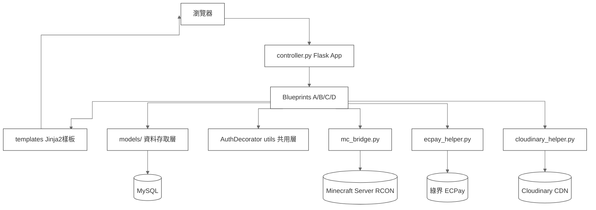
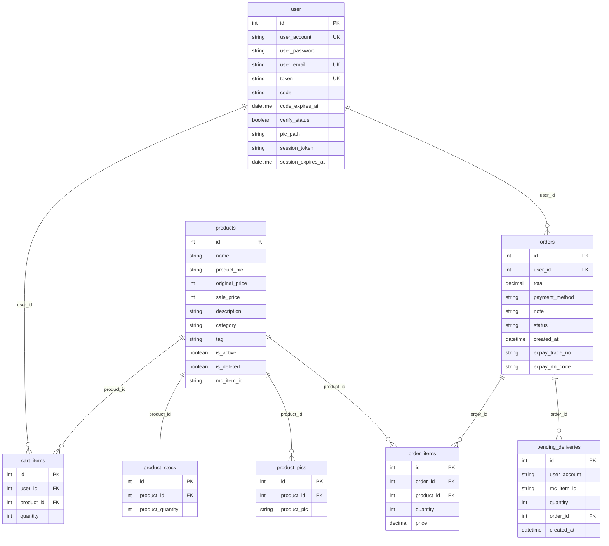
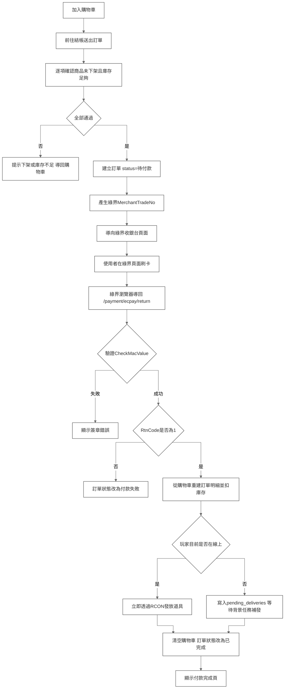
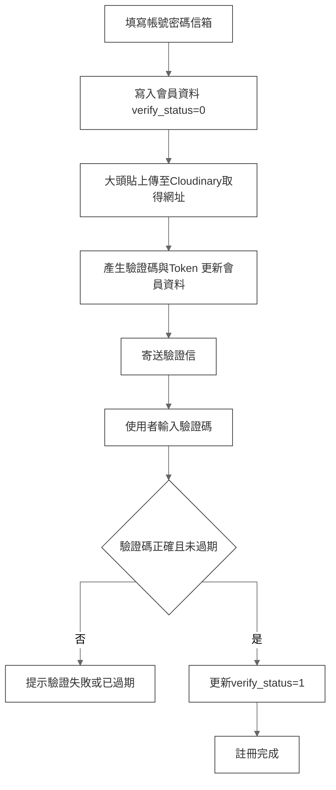
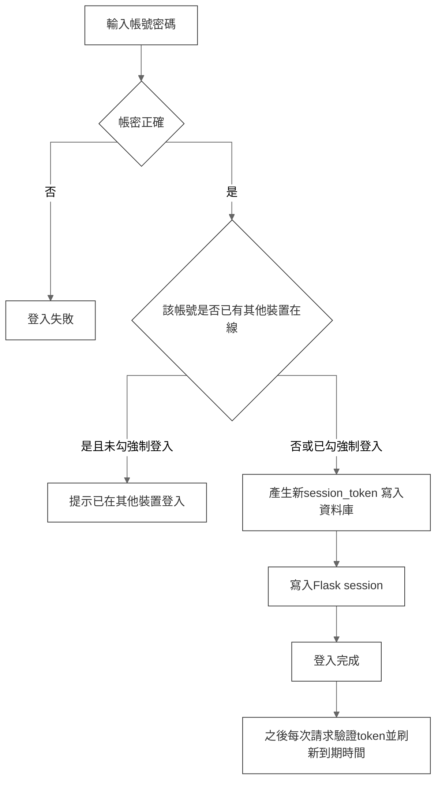

# MineMarket

## 前情提要

MineMarket 是一個結合網頁商城與遊戲伺服器的購物系統：使用者在網站上用信用卡付款，系統透過 RCON 協定即時連線 Minecraft 伺服器，把購買的道具直接發送到玩家帳號裡，不需要人工出貨。

付款走**綠界 ECPay** 正式串接（CheckMacValue 簽章驗證、信用卡收單），不是模擬付款；圖片（大頭貼、商品圖）存在 **Cloudinary**，不落地存在本機檔案系統。前端不是獨立的 SPA，而是 **Flask 搭配 Jinja2 樣板**做伺服器端渲染，頁面風格統一走 Minecraft 像素方塊視覺，部分區塊（訂單明細、後台月份日誌、後台儀表板）用 AJAX 局部載入 HTML 片段或 JSON，不整頁刷新。

技術棧：

| 層級 | 技術 |
|---|---|
| 前端 | Jinja2 樣板・原生 CSS／JS（無前端框架）・Chart.js（後台圖表） |
| 後端框架 | Flask・Flask-Mail |
| 資料庫 | MySQL（透過 `pymysql`） |
| 金流 | 綠界 ECPay（AIO 全方位金流，自行實作 CheckMacValue 簽章） |
| 圖片託管 | Cloudinary |
| 遊戲伺服器通訊 | RCON（`mcrcon`） |
| 身分驗證 | Session Cookie＋資料庫端 session token（單裝置登入、sliding session） |
| 部署 | Heroku（`gunicorn` + `Procfile`） |

---

## 系統架構



四個 Blueprint 各自負責一塊業務範圍：**A（Authentication）**帳號、註冊、登入（含單裝置登入判斷）、忘記密碼；**B（Product）**首頁商品列表、分類搜尋、商品詳情；**C（Shopping）**購物車、結帳、綠界 callback；**D（Management）**商品後台管理、銷售報表，同時也包含一般會員的會員中心、訂單查詢，靠路由各自套用的 `userRequired` 或 `adminRequired` 裝飾器區分權限。

**資料存取集中在 `models/` 套件**，依領域拆成 `user` / `product` / `cart` / `order` / `delivery` / `manage_log` / `analytics` 七個模組，`__init__.py` 統一 re-export，因此呼叫端一律寫 `from models import xxx`，不需要知道函式實際放在哪個檔案。`db.py` 的 `db_transaction` 裝飾器包住每一次呼叫，各自開一個連線、執行、commit 或 rollback、再關閉連線——每個 model 函式都是獨立的一次交易，多個函式依序呼叫不會被包在同一個交易範圍內。

**金流與圖片都是外部旁路系統，不進資料庫交易範圍**。`ecpay_helper.py` 只負責組參數、算簽章、驗簽章，不碰資料庫；`cloudinary_helper.py` 上傳圖片後只回傳一個網址字串存進資料庫欄位。兩者都是「先呼叫外部服務、再把結果寫回資料庫」的兩階段動作，中間沒有交易保護。

**權限控制集中在 `AuthDecorator.py`**，角色本身沒有獨立的資料表或欄位——`user_account == "admin"` 這個字串比對就是唯一的管理員判斷依據。登入狀態除了 Flask session 之外，額外在資料庫存一份 `session_token` 比對，同一帳號只能有一個有效登入，新登入預設會被舊登入擋下，要使用者主動選擇強制登入才會頂替。

---

## 專案結構

```
shoppingappproject/
├── controller.py            Flask 進入點，註冊四個 Blueprint
├── settings.py              全域設定（只放設定，機密一律讀 .env）
├── db.py                    db_transaction 交易裝飾器
├── utils.py                 共用工具（欄位解析、圖片、session 續期）
├── AuthDecorator.py         userRequired / adminRequired 權限裝飾器
│
├── data/                    靜態資料（與環境無關、不含邏輯）
│   └── mc_items.py          Minecraft 商品對照表（25 分類／523 項）
│
├── models/                  資料存取層，依領域拆分
│   ├── __init__.py          re-export 全部函式，呼叫端一律 from models import
│   ├── user.py              帳號與登入狀態
│   ├── product.py           商品查詢、上架、庫存
│   ├── cart.py              購物車
│   ├── order.py             訂單與金流狀態
│   ├── delivery.py          待發道具佇列
│   ├── manage_log.py        後台操作日誌
│   └── analytics.py         後台報表與統計
│
├── modules/                 業務邏輯，一個 Blueprint 一個資料夾
│   ├── Authentication/      A：註冊、登入、忘記密碼
│   ├── Product/             B：首頁、商品詳情、分類搜尋
│   ├── Shopping/            C：購物車、結帳、綠界 callback
│   └── Management/          D：後台管理、報表、會員中心
│       └── *_routers.py     只做路由宣告，實作在同資料夾的 *_services.py
│
├── ecpay_helper.py          綠界簽章與參數組裝（不碰資料庫）
├── cloudinary_helper.py     圖片上傳（不碰資料庫）
├── mc_bridge.py             Minecraft RCON 通訊
│
├── db/                      資料庫腳本
│   ├── bootstrap.sql        建立資料庫與專用帳號（root 執行一次）
│   ├── schema.sql           建表（9 張表）
│   └── seed.sql             測試資料
│
├── templates/               Jinja2 樣板（_ 開頭為 AJAX 片段）
├── static/                  CSS／JS
├── .env.example             環境變數範本
└── requirements.txt
```

分層原則：**路由（`*_routers.py`）只宣告網址，業務邏輯放 `*_services.py`，SQL 只出現在 `models/`。** 新增功能時照這三層放，不要在 router 裡直接寫 SQL。

---

## 本地端執行

需求：Python 3.12、MySQL 8.0 或 MariaDB 10.6。

**1. 建立虛擬環境並安裝套件**

```bash
python -m venv .venv
.venv\Scripts\activate          # macOS / Linux 用 source .venv/bin/activate
pip install -r requirements.txt
```

**2. 建立資料庫**

`db/bootstrap.sql` 會建立 `shoppingapp` 資料庫與同名專用帳號。執行前先把檔案裡的 `CHANGE_ME` 改成你要用的密碼：

```bash
mysql -u root -p < db/bootstrap.sql
mysql -u root -p < db/schema.sql
mysql -u root -p shoppingapp < db/seed.sql
```

`seed.sql` 是選用的，灌進去首頁才有商品可看，並會建立測試帳號 `test` / 密碼 `test1234`。

**3. 設定環境變數**

```bash
cp .env.example .env
```

打開 `.env`，至少要填 `DB_PASSWORD`（就是上一步設的密碼）。其餘項目未填會採用 `settings.py` 的預設值——寄信、圖片上傳、發貨這三項功能需要對應的金鑰才會運作，不填不影響瀏覽與下單流程。

若使用 MariaDB，記得把 `DB_PORT` 改成 `3307`。

**4. 啟動**

```bash
python controller.py
```

開啟 <http://localhost:7775>。

---

## 資料庫架構



箭頭指向「一對多」關聯中「多」的那一方，唯一的一對一關聯是 `products` 與 `product_stock`。

除了上面 8 張有關聯的表，還有一張獨立的後台操作日誌表，跟其他表沒有外鍵關聯（`product_id` 只是留底用的參考值，商品刪掉之後日誌還是要看得到當時的名稱），單獨列出：

| 欄位 | 型別 | 說明 |
|---|---|---|
| id | int PK | |
| admin_account | string | 操作的管理員帳號 |
| action | string | 上架／下架／修改／重新上架 |
| product_id | int | 當時的商品 id（商品可能已被刪除） |
| product_name | string | 當時的商品名稱（冗餘存一份，避免商品刪除後日誌看不出是哪個商品） |
| created_at | datetime | |

設計重點：

- **`user` 表把 `session_token` / `session_expires_at` 跟登入態綁在一起**，跟 `token` / `code` / `code_expires_at`（信箱驗證、忘記密碼共用）是兩組完全獨立的欄位，不要搞混：後者是「證明你收得到這封信」，前者是「證明你是目前唯一有效的登入」。
- **`user` 表已經不存姓名、手機、地址**——這些欄位在現在的程式碼裡完全沒有被查詢或寫入，註冊只收帳號、密碼、信箱、大頭貼。
- **`orders` 已經不存信用卡卡號**，付款完全交給綠界處理，本地只存 `ecpay_trade_no`（綠界訂單編號，callback 回來時用來對單）跟 `ecpay_rtn_code`（綠界回傳碼，成功或失敗原因）。
- **`pending_deliveries` 不是用外鍵存 `user_id` / `product_id`，而是直接存 `user_account` 字串跟 `mc_item_id` 字串**：即使之後會員改帳號或商品被下架，待補發的道具內容跟對象都還是當初存的那份，不會因為關聯資料變動而查不到。
- **`product_pic` / `pic_path` 現在存的是 Cloudinary 的完整網址**，不是本機路徑，前端可以直接當 `` 用。

---

## 核心流程

### 購買與付款流程



結帳送出後不會馬上扣庫存、扣款，而是先把訂單存成「待付款」，導去綠界收銀台。使用者刷卡完成後，綠界會用瀏覽器把使用者導回 `/payment/ecpay/return`，這裡才是訂單真正成立、扣庫存、發道具的地方。若玩家當下不在線上，道具改存進 `pending_deliveries`，由一個每 30 秒輪詢一次的背景執行緒補發。

**目前的主要問題**：「確認庫存」這一步只在使用者按下結帳送出訂單的當下做一次，之後使用者要在綠界頁面輸入卡號、等待授權，這中間可能耗費數十秒到數分鐘，`deduct_product_stock` 要等綠界導回才真正執行。這整段等待期間，庫存檢查完全沒有再次確認，而且跟前一版一樣，檢查與扣減之間沒有交易保護、`deduct_product_stock` 本身也沒有下限防呆。也就是說，同一件低庫存商品被多人結帳、都導去刷卡，最後幾乎同時導回時，仍然可能一起通過各自的「已扣款成功」判定，一起扣庫存到負數。而且這個版本因為多了「等待使用者在外部頁面操作」這段不可控的時間差，實際發生超賣的併發窗口比原本的版本更大。

### 註冊流程



改用 Cloudinary 之後這條流程變簡單了：圖片上傳當下就拿到最終網址，不再需要「先存暫存路徑、驗證通過才搬到正式路徑」的兩階段搬移。

### 單裝置登入



同一帳號同時間只允許一個有效登入。判斷方式是資料庫存一份 `session_token`，登入時如果已經有一份存在，預設擋下來、提示使用者選擇是否強制登入；每次需要權限的請求都會拿 session 裡的 token 跟資料庫比對，兩者不一致（代表在別處重新登入過）就強制登出，比對一致則順便把過期時間往後刷新（sliding session，`SESSION_EXPIRE_HOURS = 3`）。

---

## 已知限制

- **密碼以明文存放**：`createUser()` 直接把使用者輸入的密碼寫進 `user_password` 欄位，登入時也是用 `password != user["user_password"]` 字串比對，完全沒有雜湊。資料庫一旦外流等同帳密全數外洩，且多數使用者會重複使用密碼。這是目前最該優先修掉的問題，建議改用 `werkzeug.security` 的 `generate_password_hash` / `check_password_hash`（Flask 已內建，不需新增套件）。
- **庫存檢查與扣減之間沒有交易保護**：`db_transaction` 是「一個函式一個交易」，檢查庫存與扣庫存是兩次獨立呼叫，中間存在併發窗口。現在多了使用者在綠界頁面停留的時間，這個窗口比純本地結帳更大，理論上可能超賣。
- **管理員判斷寫死字串**：角色沒有獨立欄位或資料表，`user_account == "admin"` 是唯一依據，無法新增第二位管理員。
- **`active_tag` 資料表已無用**：`settings.py` 仍宣告 `BRANCH_C_ACTIVE_TAG_TABLE`，但全專案沒有任何程式碼使用，`db/schema.sql` 因此不建立該表。

> 以下兩項原本列在已知限制，現已修正：`login.html` 樣板缺失（已從其他分支補回）、`ecpay_return_service` 重複定義（已刪除死碼）。

---

## 結尾

MineMarket 的核心設計是把一般電商流程（商品、購物車、訂單）跟遊戲伺服器、真實金流串在同一個結帳動作裡：綠界付款成功之後才真正扣庫存、發道具，玩家離線時有背景任務保底補發。帳號系統額外做了資料庫層級的單裝置登入管控，比單純依賴 Flask session 嚴謹。架構上依業務領域切分 Blueprint、資料存取集中於單一層、金流與圖片都獨立成外部旁路模組，讓路由邏輯保持單純。目前最值得優先處理的仍然是庫存扣減與檢查之間缺乏交易層級保護的問題，而且因為現在多了使用者在綠界頁面操作的等待時間，這個併發窗口比純本地結帳的版本更大、更容易在真實流量下被觸發。
